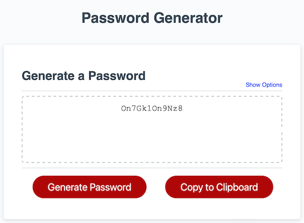

# Password Generator

## Description

I was given the task of writing JavaScript code to produce an application that generates a random password using paramaters/options provided by the user

Application functionality requirements:
- Generate a password when the button is clicked
  - Present a series of prompts for password criteria
    - Length of password
      - At least 10 characters but no more than 64.
    - Character types
      - Lowercase
      - Uppercase
      - Numeric
      - Special characters ($@%&*, etc)
  - Code should validate for each input and at least one character type should be selected
  - Once prompts are answered then the password should be generated and displayed in an alert or written to the page

The application will be completed when all of the above criteria are met and a random password is written to the page.

## Table of contents
- [Installation](#installation)
- [Usage](#usage)
- [Credits](#credits)
- [License](#license)

## Installation
N/A

## Usage
- [Deployed Application](https://trunten.github.io/ubbc-password-generator/)
- JavaScript is required for the site to function (make sure it is enabled).
    - noscript tag included to alert the user that JavaScript is required.
- A more user friendly interface is presented to the user when they click on "Show Options" just for a little fun.
- Preview of the output:

### Video of deployed application

https://user-images.githubusercontent.com/4108334/212494939-cc9a03c8-7e16-4c57-aa17-7f9e9d3c732d.mp4

### Video of deployed application with expanded options

https://user-images.githubusercontent.com/4108334/212495030-b1bc9860-dcc7-4790-ae64-0ecbfeb965f1.mp4

## Credits
- Tooltip styling: https://www.w3schools.com/css/css_tooltip.asp
- Pulse effect: https://codepen.io/FlorinPop17/pen/drJJzK
- Key favicon: https://icons8.com/
- Open Graph Link preview: https://ogp.me

## License
Please refer to the [LICENSE (MIT)](LICENSE) in the repo.
